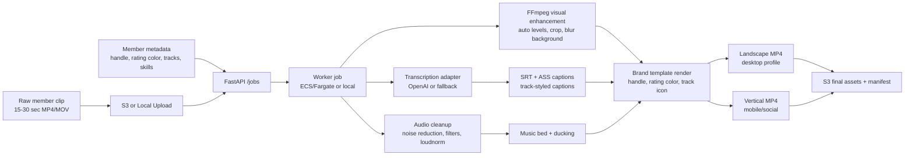

# Architecture

## Flow

## Design

The pipeline is split into small adapters so the expensive or brand-sensitive pieces can be swapped independently:

- `app/storage.py` supports local paths and `s3://` URIs.
- `app/transcription.py` selects OpenAI transcription when `OPENAI_API_KEY` is present and otherwise uses a deterministic script fallback.
- `app/audio.py` handles voice cleanup, synthetic/licensed music beds, and sidechain ducking.
- `app/video.py` owns FFmpeg rendering, Topcoder overlays, aspect-ratio variants, and caption burn-in.
- `assets/branding/topcoder-star.json` keeps the template vocabulary updateable for TCO or other event skins.

The current `topcoder-star` theme was refreshed from visible colors on `https://www.topcoder.com/`, especially the recurring teal `#00797A`, cyan `#3DDBD9`, purple `#60267D`, and light-neutral `#E9ECEF` palette used in the live homepage CSS and section backgrounds. It also uses public Topcoder logo assets for the wordmark and compact mark, plus public site SVG icons rasterized into per-track overlay badges.

This aligns with the forum clarifications:

- generated sample raw videos are acceptable for the PoC reviewer path
- external APIs/LLMs are allowed
- either local storage or cloud storage is acceptable
- the architecture should balance quality with cost instead of optimizing only for maximum polish
- the likely operating scale is roughly `1k+`, so queue-backed workers are a good fit
- the primary landscape output is 720p H.264/AAC MP4, with a separate vertical social export
- the pipeline enforces the clarified 15-30 second input duration and 30 MB per-output file-size target
- the reviewer input language is assumed to be English
- the render uses a common reusable template and customizes it from member metadata
- if multiple tracks are supplied, the first/top track is used for the lower-third icon and track label

## AI Boundary

The AI boundary in this PoC is intentionally narrow and easy to explain:

1. `app/audio.py` extracts and cleans the member's speech.
2. `app/transcription.py` sends the cleaned voice track to OpenAI transcription when `OPENAI_API_KEY` is available.
3. The transcript is converted into timed subtitle segments and styled captions.
4. `app/video.py` performs deterministic FFmpeg rendering for every visual and audio finishing step after that.

This keeps the expensive, probabilistic part of the workflow focused on the problem AI is best at here: understanding speech and returning timestamped text.

The rest of the pipeline remains deterministic so branding, reviewability, latency, and cost stay predictable.

## Production Deployment

Recommended production topology:

1. Client uploads raw clip to S3 with a presigned URL.
2. Client posts member metadata and S3 source URI to `POST /jobs`.
3. API queues an ECS/Fargate worker task or message queue job.
4. Worker downloads source, renders outputs, uploads final assets to S3, and writes `manifest.json`.
5. Profile service reads the manifest and displays the best aspect for the current surface.

This PoC keeps an in-memory job store to stay compact. For scale, replace it with SQS plus DynamoDB job state.

For reviewer convenience, the exact same pipeline also runs fully locally from filesystem input/output, which matches the forum clarification that local storage is acceptable.
